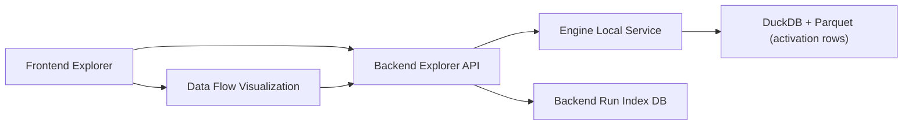

# Phase 0 Activation Explorer Spec (Backend + Frontend First)

## 1. Goals

Build a local-first Activation Explorer that helps us:

1. Run real generations with optional inline SAE extraction.
2. Inspect feature activations over token/time quickly.
3. Demonstrate the value of this infra to potential clients with a polished data-flow visualization.

## 2. Confirmed Product Decisions

1. Backend should own run indexing (not engine).
2. Auth is out of scope for v0 (local usage only).
3. Engine should remain focused on engine/runtime responsibilities, not product UI/API ownership.

## 3. Repo Ownership Boundaries

### Engine (`/Users/marshallvyletel/repos/concordance/quote/engine`)

Owns:
1. Inference runtime and backend adapters.
2. Activation extraction/storage internals (DuckDB/parquet).
3. Internal debug/dev endpoints used as a local integration surface.

Does not own:
1. Product-facing API contracts.
2. Product UI pages and presentation logic.

### Backend (`/Users/marshallvyletel/repos/concordance/quote/backend`)

Owns:
1. Activation Explorer API routes for frontend.
2. Local run index persistence and query APIs.
3. Request/response shaping for UI needs.
4. Proxy/orchestration calls into engine local service.

### Frontend (`/Users/marshallvyletel/repos/concordance/quote/frontend`)

Owns:
1. Activation Explorer route/page.
2. Explorer components (run form, tables, charts, compare UI).
3. Data Flow Visualization ("capability story" surface for demos).

## 4. Architecture (v0)

1. Frontend calls backend only.
2. Backend orchestrates engine calls.
3. Engine executes run and writes activation data locally.
4. Backend persists a run index row for fast listing/comparison.
5. Detailed row/timeline queries are proxied to engine by request_id.

## 5. Data Model Strategy

### 5.1 Activation detail source of truth

Engine DuckDB/parquet remains the source of truth for:
1. Per-token activation rows.
2. Feature deltas over time.

### 5.2 Backend run index (new)

Backend stores light metadata for fast product queries:

`activation_run_index`:
1. `request_id` (pk)
2. `created_at`
3. `model_id`
4. `prompt_chars`
5. `output_tokens`
6. `events_count`
7. `actions_count`
8. `activation_rows_count`
9. `unique_features_count`
10. `sae_enabled`
11. `sae_id`
12. `sae_layer`
13. `duration_ms`
14. `status` (`ok` or `error`)
15. `error_message` (nullable)
16. `top_features_preview` (jsonb/text json, optional)

This is an index, not a duplicate of full activation rows.

## 6. Backend API Spec (v0)

Add local-only routes in backend:

1. `POST /playground/activations/run`
2. `GET /playground/activations/runs?limit=50&cursor=...`
3. `GET /playground/activations/:request_id/summary`
4. `GET /playground/activations/:request_id/rows?feature_id=&sae_layer=&token_start=&token_end=&limit=`
5. `GET /playground/activations/:request_id/feature-deltas?feature_id=&sae_layer=&limit=`
6. `GET /playground/activations/:request_id/top-features?n=50`
7. `GET /playground/activations/health`

Behavior:
1. `run` proxies to engine fullpass endpoint and upserts `activation_run_index`.
2. `runs` and `summary` primarily read backend index.
3. `rows`/`feature-deltas`/`top-features` proxy to engine query endpoints.

## 7. Frontend Spec (v0)

New route:
1. `/playground/activations`

Core panels:
1. Run panel: prompt, model, max tokens, SAE toggles/config.
2. Output panel: text, token IDs, run summary.
3. Activation table: sortable/filterable rows.
4. Feature timeline panel: selected feature deltas over steps.
5. Compare panel: select two request_ids and show summary diffs.

## 8. Data Flow Visualization Spec (Client Demo Goal)

Add a dedicated "Flow View" tab on the explorer page.

Purpose:
1. Clearly show the journey from prompt -> tokens -> internal features -> possible actions.
2. Look polished enough for demos/partner conversations.

Visualization requirements:
1. Animated step timeline (prefill, forward pass, sampled, added).
2. Token stream lane with highlighted current token position.
3. Feature lane showing top activated features per step.
4. Optional "intervention lane" showing forced tokens/backtracks/tool calls if present.
5. Hover/click interactions:
   1. Token -> show feature snapshot.
   2. Feature -> show delta chart + metadata panel.
6. Playback controls:
   1. Play/pause
   2. Step forward/back
   3. Speed control

Design quality bar:
1. Demo-ready visual hierarchy and typography.
2. Smooth motion (no jittery rerenders).
3. Readable in desktop presentation mode.

## 9. Engine Integration Contract (v0)

Backend assumes engine exposes:
1. A run endpoint returning `request_id`, output, events/actions summary, and activation preview.
2. Feature-delta query endpoint by `request_id` + `feature_id`.
3. Optional list/summary helpers if available.

If needed, add small engine query endpoints, but avoid moving product ownership back into engine.

## 10. Local Config

Backend environment:
1. `ENGINE_BASE_URL` (default `http://127.0.0.1:8000`)
2. `ACTIVATION_EXPLORER_LOCAL_MODE=1`

No auth requirement for v0 local mode.

## 11. Implementation Phases

### Phase A: Backend API + indexing
1. Add backend activation explorer routes.
2. Add `activation_run_index` migration.
3. Implement engine proxy client and run index upsert.

### Phase B: Frontend explorer
1. Add `/playground/activations` page.
2. Implement run form + summary + table + feature timeline.
3. Add compare panel.

### Phase C: Flow View demo
1. Add "Flow View" tab with animated data-flow visualization.
2. Polish for presentation quality.

### Phase D: Stabilization
1. Add backend integration tests for new routes.
2. Add frontend smoke test for explorer page.
3. Document local startup and demo script.

## 12. Acceptance Criteria

1. User can run prompt -> inspect activations from frontend in under 2 minutes.
2. Backend run listing is fast via indexed metadata (no full row scan).
3. Feature timeline query works reliably for selected feature IDs.
4. Flow View can replay at least one real run smoothly for demos.
5. Local mode requires no auth setup.

## 13. Out of Scope (Phase 0)

1. Cloud deployment and multi-tenant hardening.
2. Full hidden-state persistence.
3. Strict deterministic replay guarantees.
4. Production auth and RBAC.

## 14. Strict API Contracts (v0)

### 14.1 `POST /playground/activations/run`

Request body:
1. `prompt` (string, required, min 1 char, max 12000 chars)
2. `model_id` (string, optional, default backend config)
3. `max_tokens` (integer, optional, default 128, allowed 1..2048)
4. `temperature` (number, optional, default 0.0, allowed 0..2)
5. `top_p` (number, optional, default 1.0, allowed 0..1)
6. `top_k` (integer, optional, default 1, allowed 1..200)
7. `collect_activations` (boolean, optional, default true)
8. `inline_sae` (boolean, optional, default true)
9. `sae_id` (string, optional)
10. `sae_layer` (integer, optional)
11. `sae_top_k` (integer, optional, default 20)
12. `sae_local_path` (string, optional)
13. `request_id` (string, optional; backend may override to ensure uniqueness)

Success response:
1. `request_id` (string)
2. `status` (`ok`)
3. `run_summary` (object):
   1. `model_id`
   2. `duration_ms`
   3. `output_tokens`
   4. `events_count`
   5. `actions_count`
   6. `activation_rows_count`
   7. `unique_features_count`
   8. `sae_enabled`
   9. `sae_id` (nullable)
   10. `sae_layer` (nullable)
4. `output` (object):
   1. `text`
   2. `token_ids` (array<int>)
5. `preview` (object):
   1. `events` (array<object>, capped to 200)
   2. `actions` (array<object>, capped to 200)
   3. `activation_rows` (array<object>, capped to 500)
6. `created_at` (ISO-8601 UTC string)

Error response:
1. `status` (`error`)
2. `error_code` (string enum)
3. `message` (string)
4. `details` (object, optional)

### 14.2 `GET /playground/activations/runs`

Query params:
1. `limit` (integer, optional, default 50, max 200)
2. `cursor` (opaque string, optional)
3. `status` (`ok` or `error`, optional)
4. `model_id` (optional)
5. `sae_enabled` (optional bool)

Success response:
1. `items` (array<run_summary>)
2. `next_cursor` (string|null)

Ordering:
1. Strictly `created_at DESC, request_id DESC`.

### 14.3 `GET /playground/activations/:request_id/summary`

Success response:
1. Single indexed summary record for request.
2. Return `404` if request_id absent.

### 14.4 `GET /playground/activations/:request_id/rows`

Query params:
1. `feature_id` (optional int)
2. `sae_layer` (optional int)
3. `token_start` (optional int)
4. `token_end` (optional int)
5. `rank_max` (optional int)
6. `limit` (optional int, default 500, max 5000)

Success response:
1. `request_id`
2. `rows` (array of activation rows)
3. `row_count`

### 14.5 `GET /playground/activations/:request_id/feature-deltas`

Query params:
1. `feature_id` (required int)
2. `sae_layer` (optional int)
3. `limit` (optional int, default 512, max 4096)

Success response:
1. `request_id`
2. `feature_id`
3. `rows` (ordered by step asc then token_position asc)

### 14.6 `GET /playground/activations/:request_id/top-features`

Query params:
1. `n` (optional int, default 50, max 500)

Success response:
1. `request_id`
2. `items` (feature aggregates)

### 14.7 `GET /playground/activations/health`

Success response:
1. `status` (`ok` or `degraded`)
2. `engine_reachable` (bool)
3. `index_db_reachable` (bool)
4. `last_error` (nullable string)

## 15. Error Codes

Backend must standardize these `error_code` values:

1. `INVALID_ARGUMENT`
2. `ENGINE_UNAVAILABLE`
3. `ENGINE_TIMEOUT`
4. `ENGINE_BAD_RESPONSE`
5. `INDEX_WRITE_FAILED`
6. `INDEX_READ_FAILED`
7. `NOT_FOUND`
8. `INTERNAL`

HTTP mapping:
1. `400`: `INVALID_ARGUMENT`
2. `404`: `NOT_FOUND`
3. `502`: `ENGINE_UNAVAILABLE`, `ENGINE_BAD_RESPONSE`
4. `504`: `ENGINE_TIMEOUT`
5. `500`: all other internal failures

## 16. Non-Functional Requirements (Local v0)

1. P50 `runs` endpoint latency under 120ms for 50-item page.
2. P95 `summary` endpoint latency under 80ms.
3. P95 row query latency under 500ms for limit=500 (single run).
4. Backend must not crash when SAE extraction is unavailable.
5. Flow View render target: stable 30+ FPS on desktop for single-run replay.

## 17. Test and Verification Contract

### 17.1 Backend

Must include:
1. Route validation tests for all new endpoints.
2. Engine proxy failure mapping tests (`502`, `504` behavior).
3. Index upsert/read consistency tests.
4. Cursor pagination ordering tests.

### 17.2 Frontend

Must include:
1. Explorer page load smoke test.
2. Run form -> success rendering test.
3. Feature selection -> timeline fetch/render test.
4. Compare panel summary diff test.
5. Flow View playback controls test.

### 17.3 End-to-end local acceptance

Manual script must prove:
1. Start engine local service.
2. Start backend.
3. Start frontend.
4. Execute one run via UI.
5. View feature timeline and flow replay.
6. Confirm backend run index populated.

## 18. Definition of Done (Phase 0)

Phase 0 is complete only when all are true:

1. Engine remains runtime-focused (no new product-only surface added there).
2. Backend provides all explorer API routes with index-backed listing.
3. Frontend has explorer + flow view in the main app.
4. Local no-auth workflow works end-to-end on a clean checkout.
5. Verification tests in Section 17 are passing.
